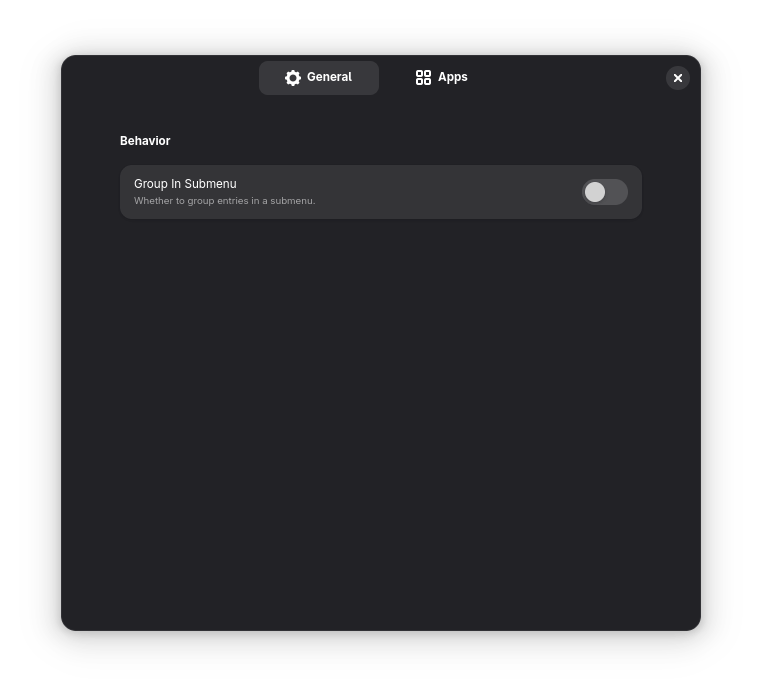

# GNOME Shell Extension - Flickernaut

[](https://extensions.gnome.org/extension/8101/flickernaut/)

[](https://hosted.weblate.org/engage/flickernaut/)


A GNOME extension that adds custom entry to Nautilus context menu for your installed dev tools, IDEs, and custom apps.

## Screenshots

<p align="center">
    
</p>

<p align="center">
    
    
    
</p>

## Requirements

 To use this extension, you need to install the `nautilus-python` package. This package acts as an extension and providing Python bindings for Nautilus. Below are the installation instructions for various Linux distributions:

### Fedora
```bash
sudo dnf install nautilus-python nautilus-extensions
```

### Ubuntu and Debian-based Distributions
```bash
sudo apt install python3-nautilus gir1.2-nautilus-3.0
```

### Arch Linux
```bash
sudo pacman -Sy python-nautilus
```

> [!NOTE]
> After making changes in the extension preferences, you need to restart Nautilus for the changes to take effect. For more details, [see here](https://gitlab.gnome.org/GNOME/nautilus-python#issues).

## Participate

### Translations

You can help to translate the extension into your language, either by directly opening a pull request with the additions you've made, or by using [Weblate](https://hosted.weblate.org/engage/flickernaut).

[](https://hosted.weblate.org/engage/flickernaut/)

### Development

This extension is developed using **TypeScript** and **Python** for Nautilus part. Make sure you have Node.js, npm and tsc installed to build the TypeScript sources.

Install the extension from source:

```bash
git clone https://github.com/imoize/flickernaut
cd flickernaut
make install
```

Then reload GNOME shell, for example by login and logout again, or under Xorg, alt+f2 and type r.

If using wayland without logout and login again, use nested wayland session:

```bash
make test-shell
```

To see extension log:

```bash
# for logs in extension's preferences
journalctl -o cat -f /usr/bin/gjs
# or
journalctl /usr/bin/gjs | grep flickernaut

# for logs in nautilus
journalctl -o cat -f /usr/bin/nautilus
# or
journalctl /usr/bin/nautilus | grep flickernaut
```
